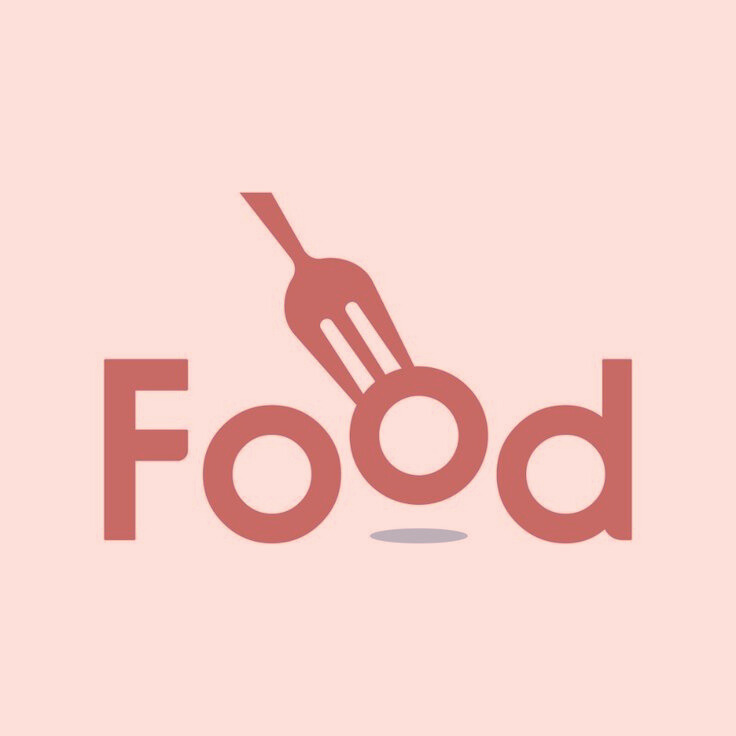
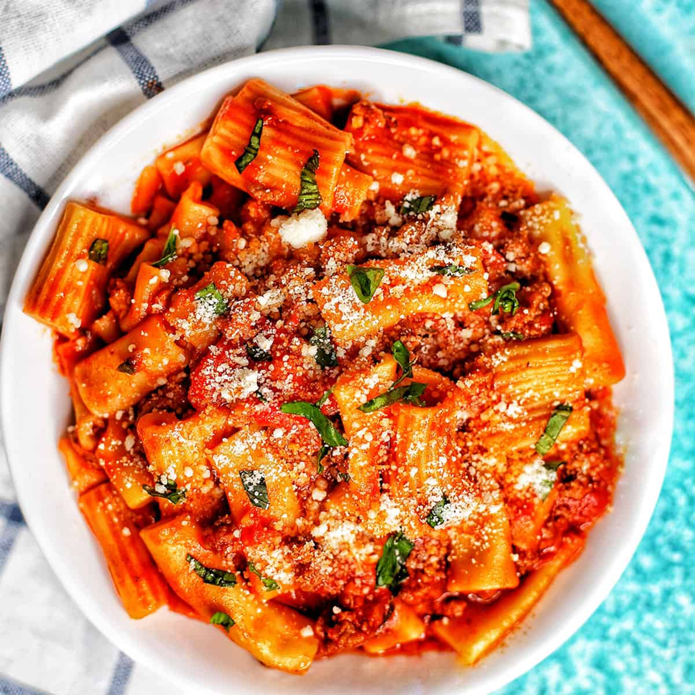
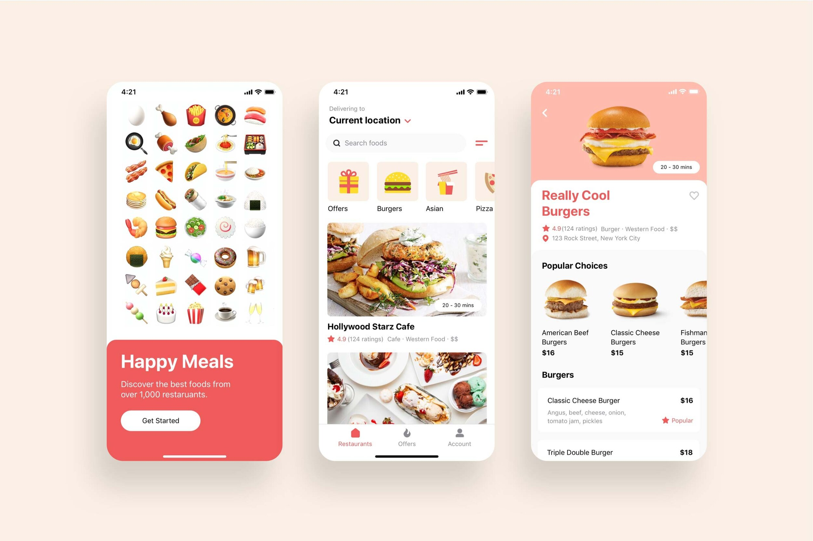

index.html
<!DOCTYPE html>
<html lang="en">
<head>
    <meta charset="UTF-8">
    <meta name="viewport" content="width=device-width,initial-scale=1.0">
    <link
     href="https://cdn.jsdelivr.net/npm/remixicon@4.3.0/fonts/remixicon.css"
     rel="stylesheet"
    />
    <link
    rel="stylesheet"
    href="https://cdn.jsdelivr.net/npm/swiper@11/swiper-bundle.min.css"
    />
    <link rel="stylesheet" href="styles.css" />
    <title>Food</title>
</head>
<body>
    <header>
        <nav>
            

                

                    
                

                

                    <i class="ri-menu-line"></i>
                

            
 
            <ul class="nav__links" id="nav-links">
                <li><a href="#home">Why Food</a></li>
                <li><a href="#service">Services</a></li>
                <li><a href="#menu">Menu</a></li>
                <li><a href="#contact">Contact</a></li> 
                <li>
                    <button class="btn">
                        <i class="ri-login-box-line"></i>
                        Login 
                    </button>
                </li> 
            </ul> 
            
 
                <button class="btn">
                    <i class="ri-login-box-line"></i>
                    Login 
                </button>
        </nav>
        

            

                
            

            

                

                    More than Faster
                    
                
  
                <h1>Be the Fastest In Delivering Your
                Food</h1>
                

                    <button class="btn">Get Started</button> 
                
     
            
    
        
        
    </header>  
    <section class="section__container service__container" id="Service">
        
WHAT WE SERVE

        <class="section__header"><h2>Your Favourite Food delivery Partner</h2>
        

            

              
              <h4>Easy To Order</h4>
              
You only need a few steps in ordering food

            
  
            

                
                <h4>Fastest Delivery</h4>
                
Delivery that is always on time even faster

            
  
            

                
                <h4>Best Quality</h4>
                
Not only fast for us quality is also number one

            
  
        
    
    </section>
    <section class="section__container menu__container" id="menu">
        
OUR MENU

        <h2 class="section__header">Menu That Always Make You Fall In Love</h2>
        

            

                

                    

                        
                        

                            <h4>Italian Red Sauce Pasta</h4>
                            <button class="btn">Order Now</button></a>  
                        

                    

                

           

                

                    
                    

                        <h4>Dum Biryani</h4>
                        <button class="btn">Order Now</button></a>
                    

                

            

            

                

                    
                    

                        <h4>Chicken Nuggets</h4>
                        <button class="btn">Order Now</button></a>
                    

                

            

            

                

                    
                    

                        <h4>Italian Pizza</h4>
                        <button class="btn">Order Now</button></a>
                    

                

            

            

                

                    
                    

                        <h4>Burrito Wrap</h4>
                        <button class="btn">Order Now</button></a>
                    

                

            

        
    
    </section>
    <section class="section__container client__container" id="client">
        

            
        

        

            
WHAT  THEY SAY

            <h2 class="section__header">What Our Customer Say About Us</h2>
            

                "Food is simply outstanding! The variety and deliciousness of their
                meals are unparalleled, offering something for every palate. What sets
                Food apart is their exceptional service. The delivery is impressively
                fast, ensuring your food arrives hot and fresh."
            

            

                
                

                  <h4>Theresa Jordan</h4>
                  <h5>Food Enthusiast</h5>
                

            
     
            

                <i class="ri-star-fill"></i>
                <i class="ri-star-fill"></i>
                <i class="ri-star-fill"></i>
                <i class="ri-star-fill"></i>
                <i class="ri-star-line"></i>
                4.7
            
 
        
 
    </section>  
    <section class="download_container" id="Contact">
        

            

                
            

            
 
                
DOWNLOAD APP

                <h2 class="section__header">Get Started With Food Today!</h2>
                

                Discover delicious food wherever and whenever you want and get your food
                delivered on time, every time.

            

                <button class="btn">Get The App</button> 
            
   
            
           
        

    </section>  
    
    <footer>
        

            

                

                    
                

                <h3="section__description">
                    Our job is to filling your tummy with  delicious food and with fast
                    and  free delivery time.</h3>
                <ul class="footer__socials">
                    <li>
                        <a href="#"><i class="ri-instagram-fill"></i></a>
                    </li>
                    <li>
                        <a href="#"><i class="ri-facebook-fill"></i></a>
                        </li>
                    <li>
                        <a href="#"><i class="ri-twitter-fill"></i></a>
                    </li>
                </ul>  
            
  
            

                <h4>About</h4>
                <ul class="footer__links">
                  <li><a href="#">About Us</a></li>
                  <li><a href="#">Features</a></li>
                  <li><a href="#">News</a></li>
                  <li><a href="#">Menu</a></li>
                </ul>
            

        

          <h4>Company</h4>
          <ul class="footer__links">
            <li><a href="#">Why Food?</a></li>
            <li><a href="#">Partner With Us</a></li>
            <li><a href="#">FAQ</a></li>
            <li><a href="#">Blog</a></li>
          </ul>
        

        

          <h4>Support</h4>
          <ul class="footer__links">
            <li><a href="#">Account</a></li>
            <li><a href="#">Support Center</a></li>
            <li><a href="#">Feedback</a></li>
            <li><a href="#">Contact Us</a></li>
            <li><a href="#">Accessibility</a></li>
          </ul>
        
 
       
 
       

        Copyright © 2024 Food. All rights reserved.
       
 
    </footer>      

  

    
    
      
</body>    
</html>

script.js
const menuBtn = document.getElementById("menu-btn");
const navLinks = document.getElementById("nav-links");
const menuBtnIcon = menuBtn.querySelector("i");

menuBtn.addEventListener("click",(e)=>{
    navLinks.classList.toggle("open");

    const isOpen = navLinks.classList.contains("open");
    menuBtnIcon.setAttribute("class",isOpen ? "ri-close-line": "ri-menu-line");
});

navLinks.addEventListener("click" ,(e) =>{
    navLinks.classList.remove("open");
    menuBtnIcon.setAttribute("class", "ri-menu-line");
});

const scrollRevealOption ={
    distance: "50px",
    origin: "bottom",
    duration: "1000"
};

ScrollReveal().reveal(".header__image img", {
    ...scrollRevealOption,
    origin: "right",
});
  ScrollReveal().reveal(".header__tag", {
    ...scrollRevealOption,
    delay: 500,
});
  ScrollReveal().reveal(".header__content h1", {
    ...scrollRevealOption,
    delay: 1000,
});
  ScrollReveal().reveal(".header__content .section__description", {
    ...scrollRevealOption,
    delay: 1500,
});
  ScrollReveal().reveal(".header__btns", {
    ...scrollRevealOption,
    delay: 2000,
});

ScrollReveal().reveal(".service__card", {
  ...scrollRevealOption,
  interval:500,
});

const swiper = new Swiper(".swiper", {
  slidesPerView: "auto",
  spaceBetween: 30,
});

ScrollReveal().reveal(".client__content .section__subheader", {
  ...scrollRevealOption,
  delay: 500,
});
ScrollReveal().reveal(".client__content .section__header", {
  ...scrollRevealOption,
  delay: 1000,
});
ScrollReveal().reveal(".client__content .section__description", {
  ...scrollRevealOption,
  delay: 1500,
});
ScrollReveal().reveal(".client__details", {
  ...scrollRevealOption,
  delay: 2000,
});
ScrollReveal().reveal(".client__rating", {
  ...scrollRevealOption,
  delay: 2500,
});
ScrollReveal().reveal(".download__image img", {
  ...scrollRevealOption,
  origin: "right",
});
ScrollReveal().reveal(".download__content .section__subheader", {
  ...scrollRevealOption,
  delay: 500,
});
ScrollReveal().reveal(".download__content .section__header", {
  ...scrollRevealOption,
  delay: 1000,
});
ScrollReveal().reveal(".download__content .section__description", {
  ...scrollRevealOption,
  delay: 1500,
});
ScrollReveal().reveal(".download__btn", {
  ...scrollRevealOption,
  delay: 2000,
});

styles.css
@import url("https://fonts.googleapis.com/css2?family=Poppins:ital,wght@0,100;0,200;0,300;0,400;0,500;0,600;0,700;0,800;0,900;1,100;1,200;1,300;1,400;1,500;1,600;1,700;1,800;1,900&display=swap");

:root {
  --primary-color: #f54748;
  --primary-color-dark: #d83e3e;
  --text-dark: #2e2e2e;
  --text-light: #595959;
  --extra-light: #f3f4f6;
  --white: #ffffff;
  --max-width: 1200px;
}

*{
    padding: 0;
    margin: 0;
    box-sizing: border-box;
}

.section__container{
    max-width: var(--max-width);
    margin: auto;
    padding: 5rem 1rem;
}

.section__header {
    font-size: 3rem;
    font-weight: 700;
    line-height: 4rem;
    color: var(--text-dark);
}

.section__subheader {
    margin-bottom: 0.5rem;
    font-size: 1rem;
    font-weight: 500;
    color: var(--primary-color);
    letter-spacing: 2px;
}

.section__description{
    line-height: 1.75rem;
    color:var(--text-light);
}

.btn {
    padding: 1rem 2rem;
    outline: none;
    border: none;
    font-size: 1rem;
    color: var(--white);
    background-color: var(--primary-color);
    white-space: nowrap;
    border-radius: 5rem;
    transition: 0.3s;
    cursor: pointer;
}
  
  .btn:hover {
    background-color: var(--primary-color-dark);
}
  
  .logo {
    display: flex;
    align-items: center;
    gap: 10px;
}
h1 {
    font-size: 4.75rem;
    font-weight: bold;
}

h2{
    font-size: 2.75rem;
    font-weight: bold;
    text-align: center;
}

p{
    text-align: center;
}
span{
    color: var(--primary-color);
}

img{
    display: flex;
    width: 100%;
} 
a {
    text-decoration: none;
    transition: 0.3s;
}
  
ul {
    list-style: none;
}
  
html,
body {
    scroll-behavior: smooth;
} 
body {
    font-family: "Poppins", sans-serif;
}
  
header {
    background: linear-gradient(
      to bottom,
      rgba(245, 71, 72, 0.1),
      rgba(245, 71, 72, 0)
    );
}
nav {
    position: fixed;
    isolation: isolate;
    width: 100%;
    z-index: 9;
}
  
.nav__header {
    padding: 1rem;
    width: 100%;
    display: flex;
    align-items: center;
    justify-content: space-between;
    background-color: var(--primary-color);
}
  
.nav__logo img {
    max-width: 50px;
}
  
.nav__logo span {
    display: none;
}
  
.nav__menu__btn {
    font-size: 1.5rem;
    color: var(--white);
    cursor: pointer;
}
  
.nav__links {
    position: absolute;
    top: 100%;
    left: 0;
    width: 100%;
    padding: 2rem;
    display: flex;
    align-items: center;
    justify-content: center;
    flex-direction: column;
    gap: 2rem;
    background-color: var(--primary-color);
    transition: 0.5s;
    z-index: -1;
    transform: translateY(-100%);

}
.nav__links.open {
    transform: translateY(0);
}
  
.nav__links a {
    font-weight: 500;
    color: var(--white);
    white-space: nowrap;
}
.nav__links a:hover{
    color: var(--text-dark);
}

.nav__links.btn:hover{
    background-color: var(--primary-color);
}
.nav__btns{
    display: none;
}

.header__container{
    display: grid;
    gap: 2rem 1rem;
    overflow: hidden;
}

.header__image img{
    max-width: 575px;
    margin-inline: auto;
}

.header__tag {
    margin-bottom: 2rem;
    max-width: fit-content;
    margin-inline: auto;
    padding: 0.75rem 1rem;
    display: flex;
    align-items: center;
    gap: 1rem;
    color: var(--primary-color);
    background-color: rgba(245, 71, 72, 0.1);
    border-radius: 5rem;
}

.header__tag img {
    max-width: 25px;
}
  
.header__content h1 {
    margin-bottom: 2rem;
    font-size: 4.75rem;
    color: var(--text-dark);
    text-align: center;
    line-height: 5.75rem;
}
  
.header__content h1 span {
    color: var(--primary-color);
}

.header__content .section__description {
    margin-bottom: 2rem;
    text-align: center;
}

.header__btns{
    display: flex;
    align-items: center;
    justify-content: center;
    gap: 2rem;
}

.header__btns a{
    display: flex;
    align-items: center;
    gap: 10px;
    color: var(--text-dark);
}

.header__btns a span {
    padding: 4px 10px;
    font-size: 1.5rem;
    color: #fdc55e;
    border-radius: 100%;
    box-shadow: 5px 5px 20px rgba(0, 0, 0, 0.1);
}
  
.header__btns a:hover {
    color: var(--primary-color);
}

.service__container.section__subheader{
    text-align: center;
}

.service__container.section__header{
    margin-bottom: 4rem;
    max-width: 600px;
    margin-inline: auto;
    text-align: center;

}
.service__grid{
    display: grid;
    gap: 2rem 1rem;
}

.service__card img {
    max-width: 175px;
    margin-inline: auto;
    margin-bottom: 2rem;
}
  
  .service__card h4 {
    margin-bottom: 0.5rem;
    font-size: 1.5rem;
    font-weight: 700;
    color: var(--text-dark);
    text-align: center;
}

.service__card p{
    max-width: 275px;
    margin-inline: auto;
    color: var(--text-light);
    text-align: center;
    line-height: 1.75rem;
}
.menu__container.section__header{
    max-width: 550px;
}

.swiper{
    width: 100%;
    margin-top: 4rem;
}

.swiper-slide{
    max-width: 350px;
}
.menu__card {
    position: relative;
    isolation: isolate;
    border-radius: 1rem;
    overflow: hidden;
}

.menu__card__details {
    position: absolute;
    width: 100%;
    height: 75%;
    bottom: 0;
    padding: 2rem;
    display: flex;
    flex-direction: column;
    justify-content: flex-end;
    background: linear-gradient(to bottom, rgba(0, 0, 0, 0), rgba(0, 0, 0, 0.75));
    z-index: 1;
}

.menu__card__details h4 {
    margin-bottom: 0.5rem;
    font-size: 1.2rem;
    font-weight: 600;
    color: var(--white);
}

.menu__card__details h5 {
    margin-bottom: 5px;
    font-size: 2rem;
    font-weight: 600;
    color: var(--white);
}
  
  .menu__card__details h5 span {
    margin-right: 10px;
    font-size: 1.2rem;
    color: #fdc55e;
}

.menu__card__details a:hover {
    color: var(--primary-color);
}

.client__container{
    display: grid;
    gap: 2rem;
    overflow: hidden;
}

.client__image img{
    max-width: 550px;
    margin-inline: auto();
}

.client__content .section__header {
    margin-bottom: 2rem;
}
  
.client__content .section__description {
    margin-bottom: 2rem;
    font-size: 1.1rem;
}
.client__details{
    margin-bottom: 2rem;
    display: flex;
    align-items: center;
    gap: 1rem;
}
.client__details img{
    max-width: 40px;
    border-radius: 100%;
}

.client__details h4 {
    font-size: 1.2rem;
    font-weight: 600;
    color: var(--text-dark);
  }
  
  .client__details h5 {
    font-size: 1rem;
    font-weight: 500;
    color: var(--text-light);
  }
  .client__rating {
    display: flex;
    align-items: center;
    gap: 10px;
  }
  
.client__rating span {
    font-size: 1.2rem;
    color: goldenrod;
  }
  
  .client__rating span:last-child {
    font-size: 1rem;
    font-weight: 500;
    color: var(--text-dark);
}
.download__container {
    background-color:rgba(245, 71, 72, 0.05);
    overflow: hidden;
}
.download__container .section__container {
    padding-block: 2rem 0;
    display: grid;
    gap: 2rem;
}
  
  
.download__content {
    padding-block: 2rem;
}
  
.download__content .section__header {
    margin-bottom: 2rem;
}
  
.download__content .section__description {
    margin-bottom: 2rem;
}
.footer__container{
    display: grid;
    gap: 4rem 2rem;
}
.footer__logo{
    margin-bottom: 2rem;
}
.footer__logo img{
    max-width: 40px;
}
.footer__logo span {
    display: flex;
    font-size: 1.5rem;
    font-weight: 600;
    color: var(--text-dark);
  }
  
  .footer__col .section__description {
    max-width: 350px;
  }
  
  .footer__socials {
    margin-top: 2rem;
    display: flex;
    align-items: center;
    gap: 1.5rem;
  }
  
  .footer__socials a {
    font-size: 1.5rem;
    color: var(--primary-color);
  }
  
  .footer__socials a:hover {
    color: var(--primary-color-dark);
  }
  
  .footer__col h4 {
    margin-bottom: 2rem;
    font-size: 1.2rem;
    font-weight: 600;
    color: var(--text-dark);
  }
  
  .footer__links {
    display: grid;
    gap: 1rem;
  }
  
  .footer__links a {
    color: var(--text-light);
  }
  
  .footer__links a:hover {
    color: var(--primary-color);
  }
  
  .footer__bar {
    padding: 1rem;
    font-size: 0.9rem;
    color: var(--text-light);
    text-align: center;
}
.footer__section__description h3{
    text-align: left;
}

@media(width > 540px){
    .service__grid{
        grid-template-columns: repeat(2,1fr);
    }

    .footer__container{
        grid-template-columns: repeat(2,fr);
    }
}

@media (width > 768px) {
    nav {
      position: static;
      padding-block: 2rem 0;
      padding-inline: 1rem;
      max-width: var(--max-width);
      margin-inline: auto;
      display: flex;
      align-items: center;
      justify-content: space-between;
      gap: 2rem;
    }

    .nav__header {
        flex: 1;
        padding: 0;
        background-color: transparent;
    }
    
    .nav__logo img{
        max-width: 60px;
    }

    .nav__logo span{
        display: flex;
        font-size: 1.5rem;
        font-weight: 600;
        color: var(--text-dark);
    }
    
    .nav__menu__btn{
        display: none;
    }

    .nav__links {
        position: static;
        width: fit-content;
        padding: 0;
        flex-direction: row;
        gap: 3rem;
        background-color: transparent;
        transform: none;
    }

    .nav__links a{
        color: var(--text-dark);
    }

    .nav__links a:hover{
        color: var(--primary-color);
    }

    .nav__links li:last-child{
        display: none;
    }

    .nav__btns{
        flex: 1;
        display: flex;
        justify-content: flex-start;
    }

    .header__image {
        grid-area: 1/2/2/3;
    }

    .header__tag {
        margin-inline-start: unset;
    }

    .header__content :is(h1, .section__description) {
        text-align: left;
      }
    .header__btns{
        justify-content: flex-start;
    } 
    
    .service__grid{
        grid-template-columns: repeat(3,1fr);
    }
    .client__container {
        grid-template-columns: repeat(2, 1fr);
        align-items: center;
    }
    .download__container .section__container {
        grid-template-columns: repeat(2, 1fr);
        align-items: center;
      }
    
      .download__image {
        grid-area: 1/2/2/3;
    }

    .footer__container {
        grid-template-columns: repeat(5, 1fr);
      }
    
      .footer__col:nth-child(1) {
        grid-column: 1/3;
      }
}

  

